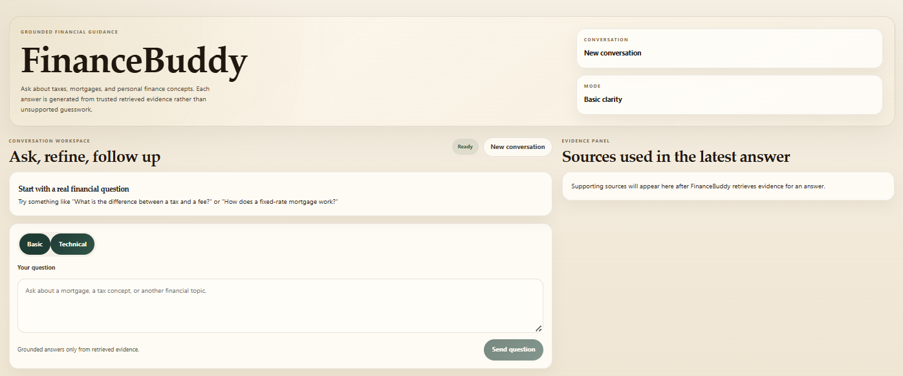

# FinanceBuddy

FinanceBuddy is a production-oriented full-stack financial education assistant built incrementally to learn backend architecture, grounded retrieval, evaluation workflows, and documentation discipline.



## Project Intent And Data Usage

- This project uses data from public sources.
- The current tax education materials are taken from publicly accessible Agencia Tributaria, CNMV, and Banco de Espana resources.
- FinanceBuddy is a non-profit project built for educational and learning purposes.
- It is intended as an engineering-learning project, not as a commercial product.

## Current Status

Current implemented scope includes:

- FastAPI backend with `GET /health`
- persistence-backed `POST /chat`
- `GET /chat/{conversation_id}` for conversation history restore
- retrieval-backed grounded answers with source references
- PostgreSQL schema managed with Alembic
- pgvector-backed chunk embeddings and semantic retrieval
- React + TypeScript + Vite frontend with explanation-level selection
- frontend conversation persistence through `conversation_id`
- visible source evidence in the UI
- retrieval evaluation datasets, manifests, and MLflow tracking

## Repository Structure

```text
FinanceBuddy/
|- backend/
|- frontend/
|- imgs/
|- infra/
|- docs/
|- .env.example
|- .gitignore
|- docker-compose.yml
`- Project_codex_prompt.txt
```

## Local Startup

### 1. Prerequisites

Make sure you have installed:

- Docker Desktop
- Python 3.12
- `uv`
- Node.js

### 2. Start infrastructure

Docker Desktop must be running before starting the project containers.

From the repository root:

```powershell
docker compose up -d
```

Services:

- Frontend: `http://localhost:5173`
- Backend: `http://127.0.0.1:8000`
- PostgreSQL + pgvector: `localhost:5432`

### 3. Docker development notes

The backend container bind-mounts [backend/src](backend/src) into `/app/src`, so ordinary backend code changes reload automatically inside the container.

After changing backend dependencies in [pyproject.toml](backend/pyproject.toml) or [uv.lock](backend/uv.lock), rebuild the backend image:

```powershell
docker compose up -d --build backend
docker compose logs backend
```

The backend container must use a psycopg v3 connection URL:

```text
postgresql+psycopg://finance_buddy:finance_buddy@db:5432/finance_buddy
```

### 4. Run the backend locally

From [backend](backend):

```powershell
cd D:\FinanceBuddy\backend
uv run uvicorn finance_buddy_backend.main:app --reload
```

The backend will be available at `http://127.0.0.1:8000`.

Useful endpoints:

- `GET /health`
- `POST /chat`
- `GET /chat/{conversation_id}`
- `GET /docs`

Running the backend locally is optional if the backend container is already healthy. It is still useful for faster debugging and script-heavy development.

### 5. Run the frontend

From [frontend](frontend):

```powershell
cd D:\FinanceBuddy\frontend
npm install
npm run dev
```

The frontend will usually be available at `http://localhost:5173`.

### 6. Ingest trusted source documents

The ingestion script requires the PostgreSQL container to be running. The backend API does not need to be running for this script.

From [backend](backend):

```powershell
cd D:\FinanceBuddy\backend
uv run python scripts/ingest_sources.py
```

This loads trusted PDF files from the configured data directory, normalizes and chunks them, and stores sources plus document chunks in the database.

### 7. Run retrieval evaluation with MLflow

From [backend](backend), start MLflow with the persistent local store:

```powershell
uv run mlflow server --backend-store-uri sqlite:///mlflow.db --default-artifact-root file:./mlartifacts --host 127.0.0.1 --port 5000
```

Then run an evaluation in another terminal:

```powershell
uv run python -m evals.run_rag_eval --dataset-path evals/datasets/tax_qa_es_v1.json --manifest-path evals/manifests/tax_qa_es_v1_manifest.json --top-k 5 --log-to-mlflow --run-name baseline_tax_es_top5
```

## Current Development Flow

1. Start Docker Desktop and bring up the containers.
2. Rebuild the backend container after dependency changes.
3. Run the backend locally only when you want a faster debug loop.
4. Run the frontend from [frontend](frontend).
5. Use `POST /chat` to create or continue a conversation.
6. Use `GET /chat/{conversation_id}` to inspect persisted message history.
7. Run the ingestion script when you want to load trusted PDF sources into PostgreSQL.
8. Run retrieval evaluation and compare MLflow runs when testing retriever changes.

## Notes

- The assistant answer is generated from retrieved evidence and returned with supporting source references.
- The frontend already supports `conversation_id`, source display, and restore of the last conversation after refresh.
- Alembic is the official schema management workflow.
- A reasonable backend optimization for a later step is to preload the sentence-transformer model at application startup and optionally download it during image build, which would trade higher steady backend container memory for lower request latency.
- Another future capability is a local-first retrieval agent with optional user-authorized public web lookup, where FinanceBuddy answers from internal trusted sources first and only searches approved public sources when the user explicitly allows it.

## Documentation Map

Project roadmap and commands:

- [Roadmap](docs/roadmap.md)
- [Agentic V1 Architecture](docs/agentic-v1-architecture.md)
- [Dev Commands](docs/dev-commands.md)

Subsystem documentation:

- [Database Layer](backend/src/finance_buddy_backend/db/README.md)
- [Frontend](frontend/README.md)
- [Evaluation And MLflow](backend/evals/README.md)

