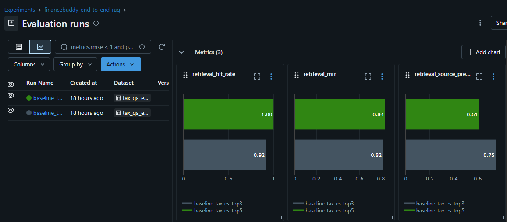

# Evaluation Layer

This folder contains the first evaluation workflow for FinanceBuddy.

Current scope:

- retrieval-only evaluation
- end-to-end system comparison for baseline RAG and Agent V1
- dataset and manifest loading
- deterministic retrieval metrics
- MLflow tracking for baseline and comparison runs

Generation quality evaluation is not implemented yet.

## Why This Layer Exists

The evaluation layer makes retrieval quality measurable before expanding deeper into end-to-end RAG evaluation.

It answers questions such as:

- Does the retriever return the expected source?
- How high is the expected source ranked?
- How much source noise appears in the retrieved set?
- Does one retriever configuration improve recall at the cost of precision?

This is intentionally separated from answer generation so retrieval quality can be measured without prompt or model noise.

## Folder Overview

- `datasets/`
  Versioned evaluation datasets. The current baseline is grounded in the Agencia Tributaria corpus.

- `manifests/`
  Metadata for each dataset: scope, assumptions, source titles, intended use, and scoring targets.

- `[models.py](models.py)`
  Pydantic contracts for dataset examples, manifests, per-example results, and aggregate run results.

- `[loaders.py](loaders.py)`
  Loads JSON files from disk and validates dataset-manifest consistency.

- `[rag_evaluator.py](rag_evaluator.py)`
  Runs retrieval-only evaluation using the real retrieval path from the backend codebase.

- `[mlflow_tracking.py](mlflow_tracking.py)`
  Logs retrieval evaluation runs to MLflow, including params, aggregate metrics, datasets, artifacts, and failure summaries.

- `[run_rag_eval.py](run_rag_eval.py)`
  CLI entrypoint for evaluation runs.

- `[system_evaluator.py](system_evaluator.py)`
  Runs end-to-end system evaluation through the real baseline and Agent V1 service paths.

- `[run_system_eval.py](run_system_eval.py)`
  CLI entrypoint for end-to-end baseline-vs-agent comparison runs.

- `metrics.py`
  Reserved for shared metric helpers. It is not the main scoring entrypoint yet because the first retrieval metrics are currently implemented directly in the evaluator.

## MLflow In This Project

MLflow is currently used as the experiment tracking layer for retrieval evaluation runs.

Each run records enough context to compare configurations later, including:

- run parameters such as dataset, manifest, and `top_k`
- aggregate retrieval metrics
- full per-example outputs
- raw evaluation inputs as artifacts
- failure summaries for weak cases
- notes that explain the current evaluation scope

This keeps evaluation evidence in one place instead of scattering results across local scripts or terminal output.

## Current Local MLflow Storage

In this project, the local MLflow files currently live under `[backend](..)`:

- metadata store: `[mlflow.db](../mlflow.db)`
- artifact root: `[mlartifacts](../mlartifacts)`

That means the MLflow server should always be started against the same backend store and artifact root if you want previous runs to remain visible after restart.

## Why Runs Can Seem To Disappear

If you start MLflow with only:

```powershell
uv run mlflow server --host 127.0.0.1 --port 5000
```

MLflow may use a different default local store depending on the working directory and startup context.

In practice, that means:

- the evaluation script still logs to `http://localhost:5000`
- but the running server may be pointing at a different local backend store
- so the UI opens successfully while showing a different set of experiments or an empty state

This is a server storage-path issue, not a problem with the evaluation code itself.

## Recommended MLflow Startup Command

From `[backend](..)` start MLflow like this:

```powershell
uv run mlflow server --backend-store-uri sqlite:///mlflow.db --default-artifact-root file:./mlartifacts --host 127.0.0.1 --port 5000
```

This pins both:

- the run metadata database to `backend/mlflow.db`
- the artifact storage location to `backend/mlartifacts`

If you want to be extra explicit, you can also use absolute Windows paths:

```powershell
uv run mlflow server --backend-store-uri sqlite:///D:/FinanceBuddy/backend/mlflow.db --default-artifact-root file:///D:/FinanceBuddy/backend/mlartifacts --host 127.0.0.1 --port 5000
```

## Example Evaluation Flow

From `[backend](..)`:

```powershell
uv run mlflow server --backend-store-uri sqlite:///mlflow.db --default-artifact-root file:./mlartifacts --host 127.0.0.1 --port 5000
```

Then run an evaluation in another terminal:

```powershell
uv run python -m evals.run_rag_eval --dataset-path evals/datasets/tax_qa_es_v1.json --manifest-path evals/manifests/tax_qa_es_v1_manifest.json --top-k 5 --log-to-mlflow --run-name baseline_tax_es_top5
```

For end-to-end comparison, run the same dataset twice:

```powershell
uv run python -m evals.run_system_eval --dataset-path evals/datasets/tax_qa_es_v1.json --manifest-path evals/manifests/tax_qa_es_v1_manifest.json --system-name baseline_rag --max-examples 5 --sleep-seconds 15 --log-to-mlflow --run-name system_baseline_rag_v1
uv run python -m evals.run_system_eval --dataset-path evals/datasets/tax_qa_es_v1.json --manifest-path evals/manifests/tax_qa_es_v1_manifest.json --system-name agentic_v1 --allow-web-search --max-examples 5 --sleep-seconds 15 --log-to-mlflow --run-name system_agentic_v1_web_v1
```

Useful throttling flags:

- `--max-examples 5`
  Use a small curated subset when your model quota is tight.

- `--sleep-seconds 15`
  Adds a pause between examples so low request-per-minute limits do not trigger rate-limit failures.

## Model Reference

### `EvaluationExample`

Represents one benchmark question.

Key fields:

- `question_id`
  Stable identifier for regression tracking.

- `question`
  The query that will be sent through the retrieval pipeline.

- `expected_source_titles`
  The expected document titles for retrieval matching in `v1`.

- `expected_answer_points`
  Used later for generation and judge-based evaluation.

- `must_refuse_without_evidence`
  Reserved for later end-to-end RAG evaluation.

### `EvaluationManifest`

Describes the dataset itself.

Key fields:

- `dataset_name`, `dataset_version`
- `stored_source_titles`
  The titles currently stored in the database and used for title-based matching.

- `scoring_targets`
  The metrics this dataset is intended to support.

- `corpus_assumptions`
  Documents the ingestion and source-title rules behind the dataset.

### `RetrievedSourceResult`

Represents one retrieved source in a per-example result.

Key fields:

- `source_id`
  Logged for debugging and local inspection.

- `title`
  Used as the primary retrieval matching key in `v1`.

- `similarity_score`
- `rank`

### `PerExampleResult`

Represents the evaluation output for one benchmark question.

Key fields:

- `retrieval_query`
  The query form used for evaluation traceability, including normalization effects.

- `retrieved_sources`
  The unique source list derived from chunk-level retrieval results.

- `retrieval_metrics`
  Per-question retrieval metrics such as hit, MRR, and precision.

### `AggregateEvaluationResult`

Represents the full outcome of one retrieval evaluation run.

Key fields:

- `aggregate_metrics`
  Dataset-level metrics logged to MLflow.

- `per_example_results`
  Full evidence used for analysis and failure inspection.

## Current Matching Rule

The current benchmark uses title-based matching.

That means:

- `expected_source_titles` is the authoritative ground truth in `v1`
- `source_id` is logged for debugging and local DB inspection

This is intentional because titles are more stable across database rebuilds than auto-increment IDs.

## Current Metrics

The retrieval evaluator currently computes:

- `retrieval_hit_rate`
- `retrieval_mrr`
- `retrieval_source_precision_at_k`

Per example, it records:

- `hit`
- `mrr`
- `precision_at_k`

## What These Metrics Mean

### `retrieval_hit_rate`

This measures whether the expected source appears anywhere in the retrieved set.

- a hit means at least one expected source was retrieved
- a miss means none of the expected sources appeared
- higher is better for recall

### `retrieval_mrr`

MRR stands for Mean Reciprocal Rank.

It rewards returning the expected source near the top of the ranking.

- if the first correct source is ranked `1`, the reciprocal rank is `1.0`
- if it is ranked `2`, the reciprocal rank is `0.5`
- if it is ranked `3`, the reciprocal rank is `0.33`
- if no expected source is retrieved, the value is `0.0`

Higher MRR means the retriever is not only finding the right source, but finding it earlier.

### `retrieval_source_precision_at_k`

This measures how clean the retrieved top-`k` set is.

It asks: out of the `k` retrieved sources, how many were actually expected?

- higher precision means less source noise
- lower precision means more irrelevant sources are mixed into the retrieved set

This is why `top_k=3` can have better precision even when `top_k=5` has better recall.

## Current Workflow

1. Load dataset JSON.
2. Load manifest JSON.
3. Validate that the dataset matches the manifest.
4. Run retrieval-only evaluation against the current PostgreSQL corpus.
5. Log the run to MLflow.

Current MLflow outputs include:

- params
- aggregate metrics
- tracked dataset input
- raw dataset artifact
- raw manifest artifact
- aggregate evaluation result JSON
- per-example results JSON
- failure summary Markdown
- evaluation notes Markdown

System evaluation runs currently log:

- params for `system_name`, explanation level, and web-search allowance
- aggregate metrics such as average latency, source hit rate, average source count, and web usage rate
- per-example JSON results with answers, sources, and basic trace-derived usage signals
- notes that explain the current comparison scope

## Current Baseline Findings

The first retrieval comparisons already showed:

- `top_k=5` gives stronger recall
- `top_k=3` gives cleaner source precision
- retrieval issues currently come more from ranking and source noise than from total recall failure

From the MLflow run comparison you captured:

- `retrieval_hit_rate`: `1.00` for `top_k=5` vs `0.92` for `top_k=3`
- `retrieval_mrr`: `0.84` for `top_k=5` vs `0.82` for `top_k=3`
- `retrieval_source_precision_at_k`: `0.61` for `top_k=5` vs `0.75` for `top_k=3`

That makes the tradeoff visible: `top_k=5` improves recall and slightly improves ranking, while `top_k=3` keeps the retrieved set cleaner.



## How To Read The MLflow Outputs

### Aggregate result JSON

Use this artifact to inspect dataset-level metrics for one run.

### Per-example results JSON

Use this artifact to inspect which benchmark questions failed, which sources were returned, and how rank changed across runs.

### Failure summary Markdown

Use this artifact to quickly review weak retrieval cases without opening the full JSON output.

### Evaluation notes Markdown

Use this artifact to document the scope and limits of the current evaluation stage.

## Next Planned Evaluation Steps

- compare query normalization on vs off
- compare baseline RAG vs Agent V1 on the same dataset in MLflow
- turn the `top_k` findings into a default retrieval configuration decision and regression checks
- improve retrieval artifacts and failure analysis
- add generation evaluation later
- add LLM-as-a-judge metrics only after retrieval evaluation is stable

## Short Interview Explanation

The evaluation layer gives FinanceBuddy a controlled way to compare retrieval behavior with real evidence. MLflow stores the runs, metrics, and artifacts needed to justify retriever decisions instead of relying on intuition or one-off tests.


