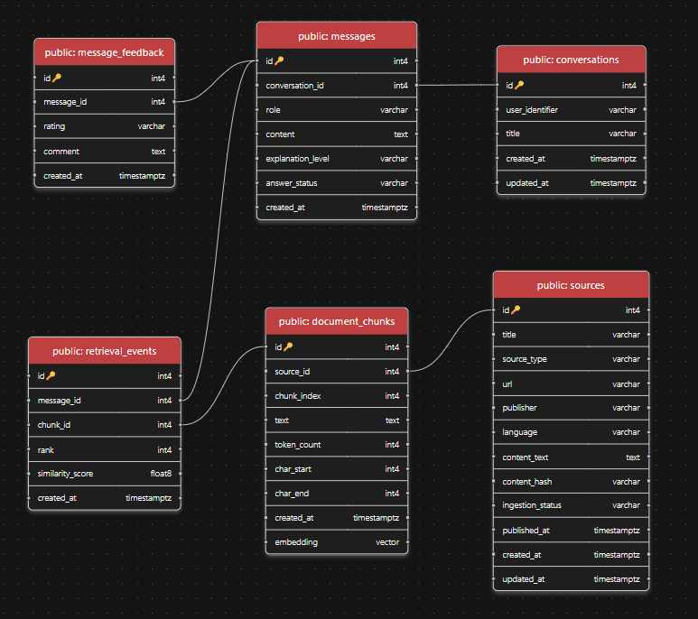

# FinanceBuddy Database Layer

This package contains the persistence layer for the FinanceBuddy backend.

The database is a core part of the RAG architecture, not just generic storage. It holds the trusted source corpus, chunk-level retrieval data, conversation history, retrieval traces, and feedback records that make the system inspectable.

## Database Schema Diagram



## Why This Schema Works For RAG

This schema keeps retrieval, chat persistence, and traceability connected without overengineering the MVP.

- `sources` and `document_chunks` support ingestion plus semantic retrieval
- `conversations` and `messages` support the user-facing product flow
- `retrieval_events` preserve evidence traces per user turn
- `message_feedback` leaves room for later feedback and evaluation workflows

## Current Status

The database layer is implemented and backed by PostgreSQL plus pgvector.

Current schema coverage:

- `sources`
- `document_chunks`
- `conversations`
- `messages`
- `retrieval_events`
- `message_feedback`

Current migration chain:

- `d19c80c2de8e_create_initial_schema`
- `0282135a117f_add_chunk_embeddings`

The second migration enables pgvector usage by creating the `vector` extension if needed and adding the `embedding` column to `document_chunks`.

## Package Layout

Main database-layer files:

- `db/base.py`
- `db/session.py`
- `db/models/conversation.py`
- `db/models/feedback.py`
- `db/models/retrieval.py`
- `db/models/source.py`
- `repositories/conversation_repository.py`
- `repositories/feedback_repository.py`
- `repositories/retrieval_repository.py`
- `repositories/source_repository.py`

## Responsibilities

### `db/base.py`

Defines the shared SQLAlchemy declarative base used by every ORM model.

### `db/session.py`

Creates the SQLAlchemy engine and session factory.

This keeps database connection setup out of routes and repositories.

### `db/models/`

Contains ORM table definitions and relationships only.

### `repositories/`

Contains query and persistence logic.

### `services/`

Coordinates higher-level workflows such as chat, ingestion, retrieval, and generation.

## Schema Overview

### `sources`

Represents one trusted parent document.

Key fields:

- `id`: primary key
- `title`: source title shown in retrieval results and UI
- `source_type`: source category such as PDF or web content
- `url`: optional public source URL
- `publisher`: optional publisher or institution name
- `language`: optional language metadata
- `content_text`: normalized full source text
- `content_hash`: used to detect duplicate or unchanged content during ingestion
- `ingestion_status`: ingestion lifecycle status
- `published_at`: optional original publication timestamp
- `created_at`, `updated_at`: persistence timestamps

Relationship:

- one `Source` has many `DocumentChunk` rows

### `document_chunks`

Stores retrieval units derived from a source.

Key fields:

- `id`: primary key
- `source_id`: foreign key to `sources.id`
- `chunk_index`: stable order of the chunk inside the parent source
- `text`: chunk text used for retrieval context
- `token_count`: token count recorded during chunking
- `char_start`, `char_end`: character span inside the parent source text
- `embedding`: `vector(768)` pgvector column used for semantic similarity search
- `created_at`: insertion timestamp

Why this table matters:

- retrieval happens at chunk granularity, not whole-document granularity
- each chunk still stays linked to its parent trusted source
- pgvector makes semantic search possible directly inside PostgreSQL

### `conversations`

Represents a chat thread.

Key fields:

- `id`: primary key
- `user_identifier`: reserved for future user scoping
- `title`: optional conversation title
- `created_at`, `updated_at`: thread timestamps

Relationship:

- one `Conversation` has many `Message` rows

### `messages`

Stores the ordered transcript for a conversation.

Key fields:

- `id`: primary key
- `conversation_id`: foreign key to `conversations.id`
- `role`: `user` or `assistant`
- `content`: raw message text
- `explanation_level`: requested explanation mode such as `basic` or `technical`
- `answer_status`: reserved answer outcome metadata
- `created_at`: insertion timestamp

Why this table matters:

- the backend can restore full conversation history
- user and assistant turns stay tied to the same thread
- answer metadata is stored with the message that produced it

### `retrieval_events`

Stores which chunks were retrieved for a user message.

Key fields:

- `id`: primary key
- `message_id`: foreign key to `messages.id`
- `chunk_id`: foreign key to `document_chunks.id`
- `rank`: retrieval rank for that chunk
- `similarity_score`: similarity returned by the retriever
- `created_at`: insertion timestamp

Why this table matters:

- it gives retrieval traceability for each user turn
- it supports debugging, failure analysis, and later observability
- it connects a chat answer back to the evidence search stage

### `message_feedback`

Stores user feedback on assistant answers.

Key fields:

- `id`: primary key
- `message_id`: foreign key to `messages.id`
- `rating`: feedback value
- `comment`: optional free-text note
- `created_at`: insertion timestamp

Why this table matters:

- feedback attaches to one answer, not to the whole conversation
- that makes evaluation and future product learning more precise

## Relationship Summary

- `sources` 1:N `document_chunks`
- `conversations` 1:N `messages`
- `messages` 1:N `retrieval_events`
- `document_chunks` 1:N `retrieval_events`
- `messages` 1:N `message_feedback`

## How pgvector Fits The Schema

FinanceBuddy uses pgvector in the `document_chunks.embedding` column.

Current shape:

- type: `vector(768)`
- model-side definition: `Vector(768)`
- migration-side activation: `CREATE EXTENSION IF NOT EXISTS vector`

This lets the retrieval repository run semantic similarity search over stored chunk embeddings instead of scanning raw text.

## How To Check That The Database Is Up To Date

### 1. Check Alembic head

From `[backend](/d:/FinanceBuddy/backend)`:

```powershell
uv run alembic current
uv run alembic heads
```

Expected result:

- current revision should be `0282135a117f`
- head revision should also be `0282135a117f`

If the current revision is behind, run:

```powershell
uv run alembic upgrade head
```

### 2. Check that pgvector is enabled

Inside PostgreSQL:

```sql
SELECT extname FROM pg_extension WHERE extname = 'vector';
```

Expected result:

- one row with `vector`

### 3. Check that `document_chunks.embedding` exists

```sql
SELECT column_name, data_type
FROM information_schema.columns
WHERE table_name = 'document_chunks'
ORDER BY ordinal_position;
```

Expected result:

- an `embedding` column should be present

### 4. Check the current table set

```sql
SELECT table_name
FROM information_schema.tables
WHERE table_schema = 'public'
ORDER BY table_name;
```

Expected result should include:

- `conversations`
- `document_chunks`
- `message_feedback`
- `messages`
- `retrieval_events`
- `sources`
- `alembic_version`

## Summary

FinanceBuddy uses PostgreSQL plus pgvector as a persistence and retrieval backbone. The schema separates trusted sources, chunk embeddings, chat history, retrieval traces, and feedback so the system can generate grounded answers while staying debuggable and extensible.
