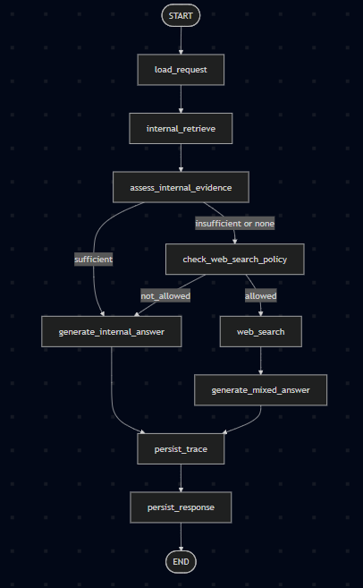

# Agentic V1 Architecture

This document defines the first LangGraph design for the `agentic_v1` branch.

The goal of this branch is to add controlled agent behavior in parallel to the
existing RAG flow without replacing the baseline chat path.

## Objective

The `agentic_v1` branch should introduce:

- explicit LangGraph state
- explicit node responsibilities
- explicit edge conditions
- internal-first retrieval behavior
- optional, policy-controlled public web lookup
- runtime trace events for graph execution

It should not introduce:

- unconstrained autonomous tool use
- public web lookup before internal retrieval
- replacement of the default RAG path
- MLflow as the primary runtime tracing system

## Design Principles

- The trusted internal corpus remains the primary source of truth.
- The graph must be easy to explain, test, and debug.
- Product policy must constrain web search, not just model preference.
- Source provenance must stay explicit when internal and public sources are mixed.
- The baseline RAG path must remain stable for comparison.

## Scope

This first design pass covers:

- state schema
- node list
- edge map
- branch decisions
- trace event model

This first design pass does not yet commit to:

- a final web search provider
- a final persistence schema for agent traces
- replacing the current `POST /chat` path

## Agent State V1

The LangGraph state should stay small, explicit, and auditable.

### Request And Identity

- `conversation_id: int | None`
- `user_message_id: int | None`
- `question: str`
- `explanation_level: str`

### Policy Inputs

- `user_allows_web_search: bool`
- `web_search_policy_reason: str | None`

### Retrieval

- `retrieval_query: str | None`
- `internal_chunks: list[dict]`
- `internal_sources: list[dict]`

### Decision State

- `internal_evidence_status: str | None`
- `web_search_decision: str | None`

### Public Search

- `web_search_query: str | None`
- `web_results: list[dict]`
- `web_sources: list[dict]`

### Final Output

- `final_sources: list[dict]`
- `answer: str | None`
- `answer_status: str | None`

### Observability

- `trace_events: list[dict]`
- `errors: list[str]`

## Decision Enums

### `internal_evidence_status`

Allowed values:

- `sufficient`
- `insufficient`
- `none`

Meaning:

- `sufficient`: internal evidence is enough to answer confidently
- `insufficient`: some useful internal evidence exists but not enough for a confident answer
- `none`: retrieval found no meaningful support

### `web_search_decision`

Allowed values:

- `not_needed`
- `not_allowed`
- `allowed`

Meaning:

- `not_needed`: internal evidence is already enough
- `not_allowed`: web search could help but policy or user permission blocks it
- `allowed`: the graph may proceed to the web search node

### `answer_status`

Allowed values:

- `answered_internal`
- `answered_mixed_sources`
- `insufficient_internal_only`
- `generation_failed`
- `agent_failed`

Meaning:

- `answered_internal`: the answer was generated from internal trusted sources only
- `answered_mixed_sources`: the answer used internal plus public sources
- `insufficient_internal_only`: the response stayed internal-only and clearly stated limitations
- `generation_failed`: a generation node failed
- `agent_failed`: a broader workflow failure occurred

## Node List V1

### `load_request`

Purpose:

- initialize graph state from the API request
- load request identifiers and policy flags

Writes:

- request and identity fields
- policy input fields

### `internal_retrieve`

Purpose:

- run the existing trusted-source retriever first

Writes:

- `retrieval_query`
- `internal_chunks`
- `internal_sources`

### `assess_internal_evidence`

Purpose:

- judge whether internal evidence is enough for a grounded answer

Writes:

- `internal_evidence_status`

### `check_web_search_policy`

Purpose:

- apply product rules to decide whether web search may be used

Writes:

- `web_search_decision`
- `web_search_policy_reason`

### `web_search`

Purpose:

- run optional public lookup only when allowed

Writes:

- `web_search_query`
- `web_results`
- `web_sources`

### `generate_internal_answer`

Purpose:

- generate a grounded answer from internal evidence only

Writes:

- `final_sources`
- `answer`
- `answer_status`

### `generate_mixed_answer`

Purpose:

- generate an answer from internal plus public evidence with explicit provenance

Writes:

- `final_sources`
- `answer`
- `answer_status`

### `persist_trace`

Purpose:

- persist node-level execution events for debugging and later analysis

Writes:

- no business-state fields beyond trace persistence metadata if needed

### `persist_response`

Purpose:

- store the assistant response and attached sources

Writes:

- persistence side effects outside the graph state

## Edge Map V1

Base flow:

- `START -> load_request`
- `load_request -> internal_retrieve`
- `internal_retrieve -> assess_internal_evidence`

Branching:

- if `internal_evidence_status == sufficient`
  `assess_internal_evidence -> generate_internal_answer`

- if `internal_evidence_status in {insufficient, none}`
  `assess_internal_evidence -> check_web_search_policy`

- if `web_search_decision == not_allowed`
  `check_web_search_policy -> generate_internal_answer`

- if `web_search_decision == allowed`
  `check_web_search_policy -> web_search -> generate_mixed_answer`

Finish:

- `generate_internal_answer -> persist_trace -> persist_response -> END`
- `generate_mixed_answer -> persist_trace -> persist_response -> END`

Failure handling:

- any node failure should append a trace event, set an appropriate error status, and route to a safe failure response path

## Visible Graph

## Trace Event Model V1

Each node should append a small structured trace event.

Recommended fields:

- `node_name: str`
- `status: str`
- `started_at: str`
- `finished_at: str | None`
- `latency_ms: float | None`
- `summary: str | None`

Example statuses:

- `started`
- `completed`
- `failed`
- `skipped`

## Why This Design

This graph is intentionally narrow.

It gives FinanceBuddy:

- controlled branching
- internal-first evidence handling
- a clean place to add web search later
- a traceable workflow that can be compared to the baseline RAG path

It avoids:

- overbuilding the first agent version
- hiding product logic inside prompt text
- making web search the default answer path

## Next Design Step

After this document, the next step should be to define node contracts in more detail:

- exact inputs per node
- exact outputs per node
- node failure behavior
- which nodes are deterministic versus model-based
