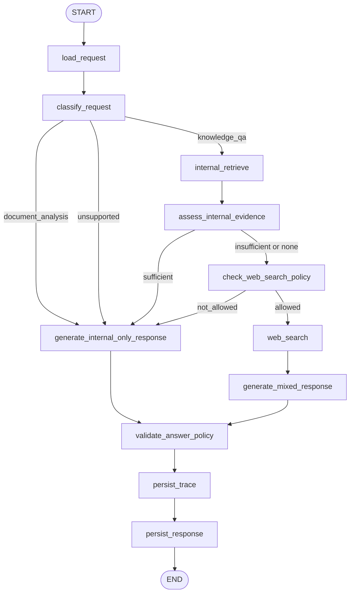

# Agentic V1 Architecture

This document defines the first LangGraph design for the `agentic_v1` branch.

The goal of this branch is to add controlled agent behavior in parallel to the
existing RAG flow without replacing the baseline chat path.

This version of the document reflects a refined V1.1 design:

- the graph is extensible enough to support future task routing
- the first runnable implementation remains intentionally narrow
- only the `knowledge_qa` path is planned for the first working version

## Current Implementation Status

The branch now has a first runnable internal-only slice.

Implemented today:

- explicit `AgentState`
- a compiled LangGraph path exposed through `POST /agent/chat`
- `load_request`
- `classify_request`
- `internal_retrieve`
- `assess_internal_evidence`
- `generate_internal_only_response`
- frontend switching between baseline RAG and Agent V1
- debug-only runtime `trace_events` returned by the agent path
- debug-only frontend visibility for agent trace events and retrieved chunk scores

Not implemented yet:

- `check_web_search_policy`
- `web_search`
- `generate_mixed_response`
- `validate_answer_policy`
- persistence-backed runtime traces
- real document-analysis execution

This matters because the current branch is no longer design-only. It now contains a narrow runnable internal-only path that can be compared against the baseline UI and API behavior.

## Objective

The `agentic_v1` branch should introduce:

- explicit LangGraph state
- explicit node responsibilities
- explicit edge conditions
- lightweight request routing
- internal-first retrieval behavior
- optional, policy-controlled public web lookup
- answer policy validation
- runtime trace events for graph execution

It should not introduce:

- unconstrained autonomous tool use
- public web lookup before internal retrieval
- replacement of the default RAG path
- MLflow as the primary runtime tracing system

## Design Principles

- The trusted internal corpus remains the primary source of truth.
- The graph must be easy to explain, test, and debug.
- Product policy must constrain web search, not just model preference.
- Source provenance must stay explicit when internal and public sources are mixed.
- The baseline RAG path must remain stable for comparison.

## Scope

This first design pass covers:

- state schema
- node list
- edge map
- branch decisions
- trace event model
- future extension points for non-QA tasks

This first design pass does not yet commit to:

- a final web search provider
- a final persistence schema for agent traces
- replacing the current `POST /chat` path
- implementing document analysis in the first runnable version

## Agent State V1

The LangGraph state should stay small, explicit, and auditable.

### Request And Identity

- `conversation_id: int | None`
- `user_message_id: int | None`
- `question: str`
- `explanation_level: str`

### Routing

- `request_type: str | None`
- `request_type_confidence: float | None`

### Policy Inputs

- `web_access_mode: str`
- `web_search_policy_reason: str | None`

### Retrieval

- `retrieval_query: str | None`
- `internal_retrieval_status: str | None`
- `internal_chunks: list[dict]`
- `internal_sources: list[dict]`

### Decision State

- `internal_evidence_status: str | None`
- `web_search_decision: str | None`

### Public Search

- `web_search_query: str | None`
- `web_results: list[dict]`
- `web_sources: list[dict]`

### Final Output

- `final_sources: list[dict]`
- `answer: str | None`
- `answer_status: str | None`
- `answer_policy_flags: list[str]`
- `requires_disclaimer: bool`

### Observability

- `trace_events: list[dict]`
- `errors: list[str]`

## Decision Enums

### `request_type`

Allowed values:

- `knowledge_qa`
- `document_analysis`
- `unsupported`

Meaning:

- `knowledge_qa`: the current grounded question-answering path
- `document_analysis`: reserved for future bill and document interpretation workflows
- `unsupported`: the request falls outside the supported product scope

Implementation note:

- only `knowledge_qa` is implemented in the first runnable version
- `document_analysis` is a routing placeholder, not a completed feature

### `web_access_mode`

Allowed values:

- `disabled`
- `fallback_only`
- `allowed`

Meaning:

- `disabled`: public web lookup is not permitted for the request
- `fallback_only`: public web lookup is permitted only if internal evidence is not enough
- `allowed`: public web lookup is permitted by policy

### `internal_retrieval_status`

Allowed values:

- `ok`
- `empty`
- `failed`

Meaning:

- `ok`: retrieval executed and returned candidate evidence
- `empty`: retrieval executed but returned no useful candidates
- `failed`: retrieval failed technically

### `internal_evidence_status`

Allowed values:

- `sufficient`
- `insufficient`
- `none`

Meaning:

- `sufficient`: internal evidence is enough to answer confidently
- `insufficient`: some useful internal evidence exists but not enough for a confident answer
- `none`: retrieval found no meaningful support

### `web_search_decision`

Allowed values:

- `not_needed`
- `not_allowed`
- `allowed`

Meaning:

- `not_needed`: internal evidence is already enough
- `not_allowed`: web search could help but policy or user permission blocks it
- `allowed`: the graph may proceed to the web search node

### `answer_status`

Allowed values:

- `answered_internal`
- `answered_mixed_sources`
- `insufficient_internal_only`
- `generation_failed`
- `agent_failed`

Meaning:

- `answered_internal`: the answer was generated from internal trusted sources only
- `answered_mixed_sources`: the answer used internal plus public sources
- `insufficient_internal_only`: the response stayed internal-only and clearly stated limitations
- `generation_failed`: a generation node failed
- `agent_failed`: a broader workflow failure occurred

## Node List V1

### `load_request`

Purpose:

- initialize graph state from the API request
- load request identifiers and policy flags

Writes:

- request and identity fields
- policy input fields

### `classify_request`

Purpose:

- classify the incoming request into the supported routing space

Writes:

- `request_type`
- `request_type_confidence`

### `internal_retrieve`

Purpose:

- run the existing trusted-source retriever first

Writes:

- `retrieval_query`
- `internal_retrieval_status`
- `internal_chunks`
- `internal_sources`

### `assess_internal_evidence`

Purpose:

- judge whether internal evidence is enough for a grounded answer

Writes:

- `internal_evidence_status`

### `check_web_search_policy`

Purpose:

- apply product rules to decide whether web search may be used

Writes:

- `web_search_decision`
- `web_search_policy_reason`

Implementation status:

- not implemented yet in the current runnable slice

### `web_search`

Purpose:

- run optional public lookup only when allowed

Writes:

- `web_search_query`
- `web_results`
- `web_sources`

Implementation status:

- not implemented yet in the current runnable slice

### `generate_internal_only_response`

Purpose:

- generate an internal-only response
- this may be a grounded answer or a safe limited response when evidence is weak

Writes:

- `final_sources`
- `answer`
- `answer_status`

### `generate_mixed_response`

Purpose:

- generate an answer from internal plus public evidence with explicit provenance

Writes:

- `final_sources`
- `answer`
- `answer_status`

Implementation status:

- not implemented yet in the current runnable slice

### `validate_answer_policy`

Purpose:

- verify that the final response respects FinanceBuddy product and safety constraints

Writes:

- `answer_policy_flags`
- `requires_disclaimer`
- adjusted `answer_status` only if policy validation forces a safe fallback

Implementation status:

- not implemented yet in the current runnable slice

### `persist_trace`

Purpose:

- persist node-level execution events for debugging and later analysis

Writes:

- no business-state fields beyond trace persistence metadata if needed

Implementation status:

- not implemented yet
- temporary trace visibility currently exists through `trace_events` returned by `/agent/chat`

### `persist_response`

Purpose:

- store the assistant response and attached sources

Writes:

- persistence side effects outside the graph state

Implementation status:

- response persistence currently happens in `AgentChatService`, not in a dedicated graph node

## Edge Map V1

Current runnable edge map:

- `START -> load_request -> classify_request`
- `classify_request -> internal_retrieve` for `knowledge_qa`
- `classify_request -> generate_internal_only_response` for `document_analysis`
- `classify_request -> generate_internal_only_response` for `unsupported`
- `internal_retrieve -> assess_internal_evidence`
- `assess_internal_evidence -> generate_internal_only_response` for `sufficient`, `insufficient`, and `none`
- `generate_internal_only_response -> END`

This is intentionally narrower than the full target map below.

Base flow:

- `START -> load_request`
- `load_request -> classify_request`
- `classify_request -> internal_retrieve` for `knowledge_qa`
- `classify_request -> generate_internal_only_response` for `document_analysis`
- `classify_request -> generate_internal_only_response` for `unsupported`
- `internal_retrieve -> assess_internal_evidence`

Branching:

- if `internal_evidence_status == sufficient`
  `assess_internal_evidence -> generate_internal_only_response`

- if `internal_evidence_status in {insufficient, none}`
  `assess_internal_evidence -> check_web_search_policy`

- if `web_search_decision == not_allowed`
  `check_web_search_policy -> generate_internal_only_response`

- if `web_search_decision == allowed`
  `check_web_search_policy -> web_search -> generate_mixed_response`

Finish:

- `generate_internal_only_response -> validate_answer_policy -> persist_trace -> persist_response -> END`
- `generate_mixed_response -> validate_answer_policy -> persist_trace -> persist_response -> END`

Failure handling:

- any node failure should append a trace event, set an appropriate error status, and route to a safe failure response path

## Visible Graph

## Trace Event Model V1

Each node should append a small structured trace event.

Recommended fields:

- `node_name: str`
- `status: str`
- `started_at: str`
- `finished_at: str | None`
- `latency_ms: float | None`
- `summary: str | None`

Example statuses:

- `started`
- `completed`
- `failed`
- `skipped`

Current implementation note:

- the current runnable slice appends lightweight trace events directly into `state["trace_events"]`
- those trace events are currently returned by `POST /agent/chat` for development debugging
- they are not yet persisted in the application database

Current event shape includes fields such as:

- `node_name`
- `status`
- `summary`
- `retrieval_status`
- `scores`
- `decision`
- `chunk_count`
- `source_count`
- `answer_status`

## Why This Design

This graph is intentionally narrow.

It gives FinanceBuddy:

- controlled branching
- explicit room for future task routing
- internal-first evidence handling
- a clean place to add web search later
- a traceable workflow that can be compared to the baseline RAG path

It avoids:

- overbuilding the first agent version
- hiding product logic inside prompt text
- making web search the default answer path

## First Runnable Scope

The first working implementation should stay narrow.

Implemented in the first runnable version:

- `knowledge_qa` request routing
- internal retrieval first
- evidence assessment
- internal-only response generation
- debug-only runtime tracing returned by the agent route
- frontend comparison between baseline RAG and Agent V1
- frontend debug visibility for trace events and retrieved chunk scores

Not implemented yet in the first runnable version:

- `check_web_search_policy`
- `web_search`
- mixed-source response generation
- answer policy validation
- persistence-backed runtime tracing
- real `document_analysis` execution
- expanded task taxonomy beyond the minimal routing enum
- detailed token and cost observability
- a rich policy-flag taxonomy

## Capability And Tool Approach

FinanceBuddy should treat "tools" as explicit backend capabilities owned by the graph, not as unconstrained model-selected actions.

Current capability:

- `internal_retrieve`

Planned capabilities:

- `web_search`
- `document_extract`
- `document_analyze`
- `generate_answer`
- `validate_answer_policy`

Recommended orchestration rule:

- internal retrieval should remain the default first capability for `knowledge_qa`
- public web lookup should remain policy-gated and later in the graph
- document extraction should only be available on document-oriented tasks
- model reasoning may assist routing later, but capability availability should remain constrained by product policy and graph design

This means the branch should evolve toward a graph of controlled capabilities, not toward a free-form autonomous tool-calling chatbot.

## Next Design Step

After this document, the next step should be to formalize the next capability layer:

- exact contracts for `check_web_search_policy`
- exact contracts for `web_search`
- explicit mixed-source provenance rules
- exact separation between deterministic routing, policy gating, and any later model-assisted decisions
