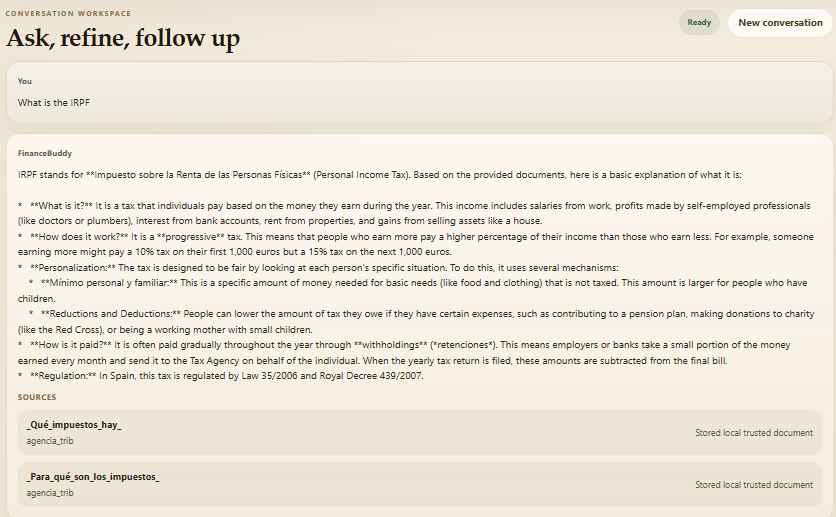

# FinanceBuddy Frontend

This frontend is the user-facing interface for the FinanceBuddy grounded chat experience.

It is built with React, TypeScript, and Vite, and currently focuses on a clean MVP workflow for asking financial questions, receiving grounded answers, and inspecting the supporting sources returned by the backend.

## Current UI Capabilities

The current interface provides:

- a chat workspace for user and assistant turns
- an explanation-level toggle with `basic` and `technical` modes
- conversation persistence through `conversation_id`
- automatic restoration of the last conversation after refresh
- an evidence panel showing the sources used in the latest answer
- per-message source cards inside assistant answers
- loading, restore, and request-error states
- a button to reset the current conversation and start a new one

## What The User Can Do

### Ask grounded questions

The user can submit questions about taxes, mortgages, and personal finance concepts.

The frontend sends:

- `message`
- `explanation_level`
- `conversation_id` when continuing an existing thread

### Switch explanation depth

The UI supports two explanation modes:

- `basic`: simpler explanations for clarity
- `technical`: deeper wording for more advanced users

### Continue a saved conversation

The frontend stores the current `conversation_id` in local storage and restores the thread from the backend on page reload.

### Inspect supporting evidence

The frontend shows sources in two places:

- inline on each assistant message
- in a dedicated side panel for the latest answer

For each source, the UI can show:

- title
- publisher when available
- link to the original source when available
- a local-document note when the source comes from trusted stored content


## Backend Integration

Current API integration:

- `POST /chat`
  - sends the user message, explanation level, and optional conversation id
  - receives the grounded answer, sources, and current conversation id

- `GET /chat/{conversation_id}`
  - restores the persisted conversation history from the backend

## Current File Focus

The current UI behavior is primarily orchestrated from:

- `[App.tsx](src/App.tsx)`
- `[App.css](src/App.css)`

## Local Development

From `[frontend](.)`:

```powershell
npm install
npm run dev
```

The frontend expects the backend base URL through:

- `VITE_API_BASE_URL`

Default fallback:

- `http://127.0.0.1:8000`

## UI Screenshots




## Current UX Scope

This is intentionally still an MVP.

What is already covered well:

- grounded chat flow
- visible evidence
- conversation continuity
- basic request-state handling

To do next:

- source-inspection drill-down
- user feedback submission UI
- conversation list or history browser
- authentication and multi-user separation
- advanced observability surfaced in the UI

## Summary

The frontend is designed to make a RAG system understandable to the user. It does not only display answers; it also exposes source evidence, preserves conversation continuity, and lets the user control explanation depth, which makes the product feel more trustworthy and production-oriented.

